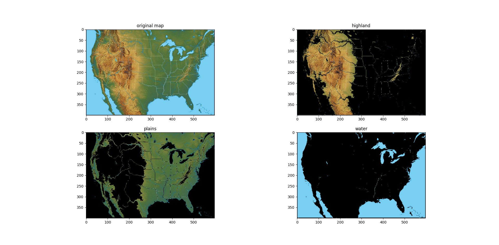

# SVM Terrain Classifier

This project uses a Support Vector Machine (SVM) to classify terrain types in a topographical map, specifically focusing on identifying three terrain categories:

- **Plains**
- **Highlands**
- **Water**

The model is trained to recognize distinct color patterns in maps and is capable of segmenting maps based on these features. The classifier is designed to work with simple topographical maps where terrain types are represented by clear and distinguishable colors.

## Features

- **Terrain Classification**: Classifies plains, highlands, and water using an SVM with an RBF kernel.
- **Extensible**: Can be adapted to classify other terrain types with additional training data.
- **Modular Code**: Easy to modify and extend the model to support different machine learning algorithms.

## Example Output

Here is an example of the terrain classification utilizing a linear kernel:


## Prerequisites

You will need Python 3.x and the following libraries:
- `numpy`
- `matplotlib`
- `Pillow`
- `scikit-learn`

## Installation

To install the required libraries locally, open a terminal (preferably in a python environment) and run:

```bash
pip install numpy matplotlib pillow scikit-learn
